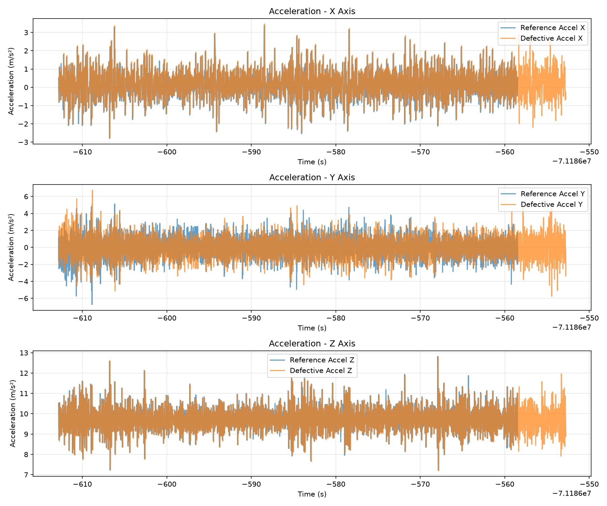
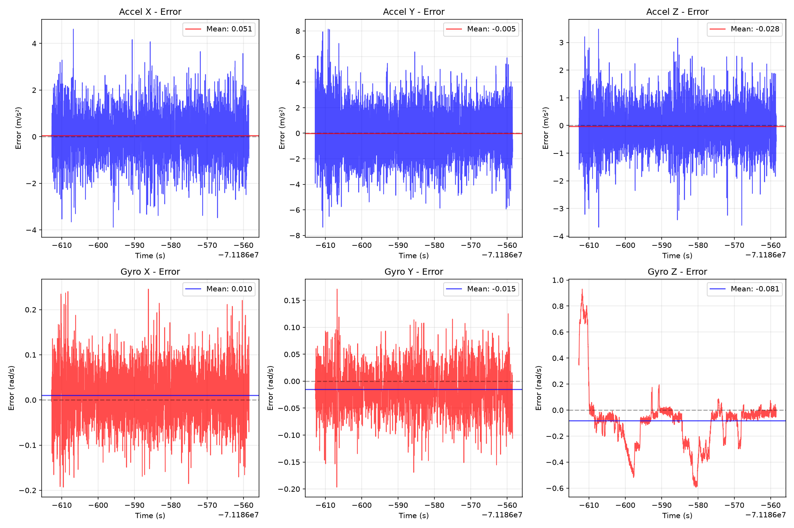
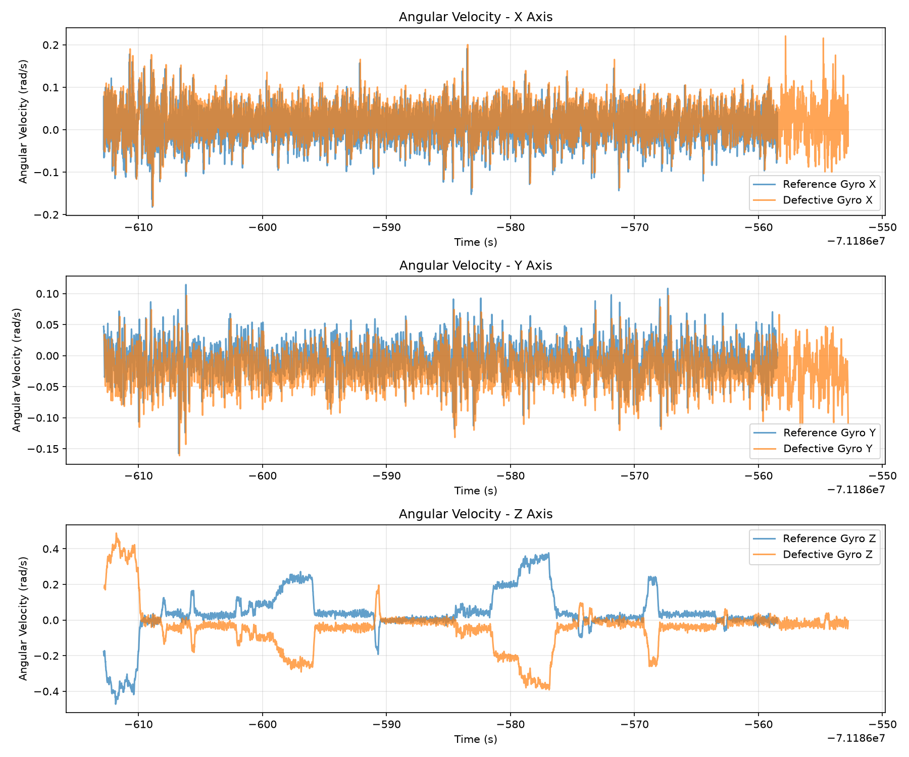
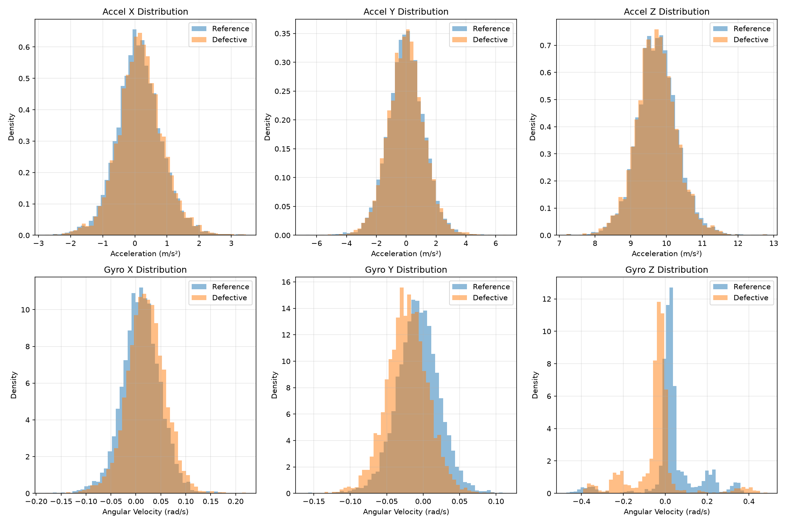
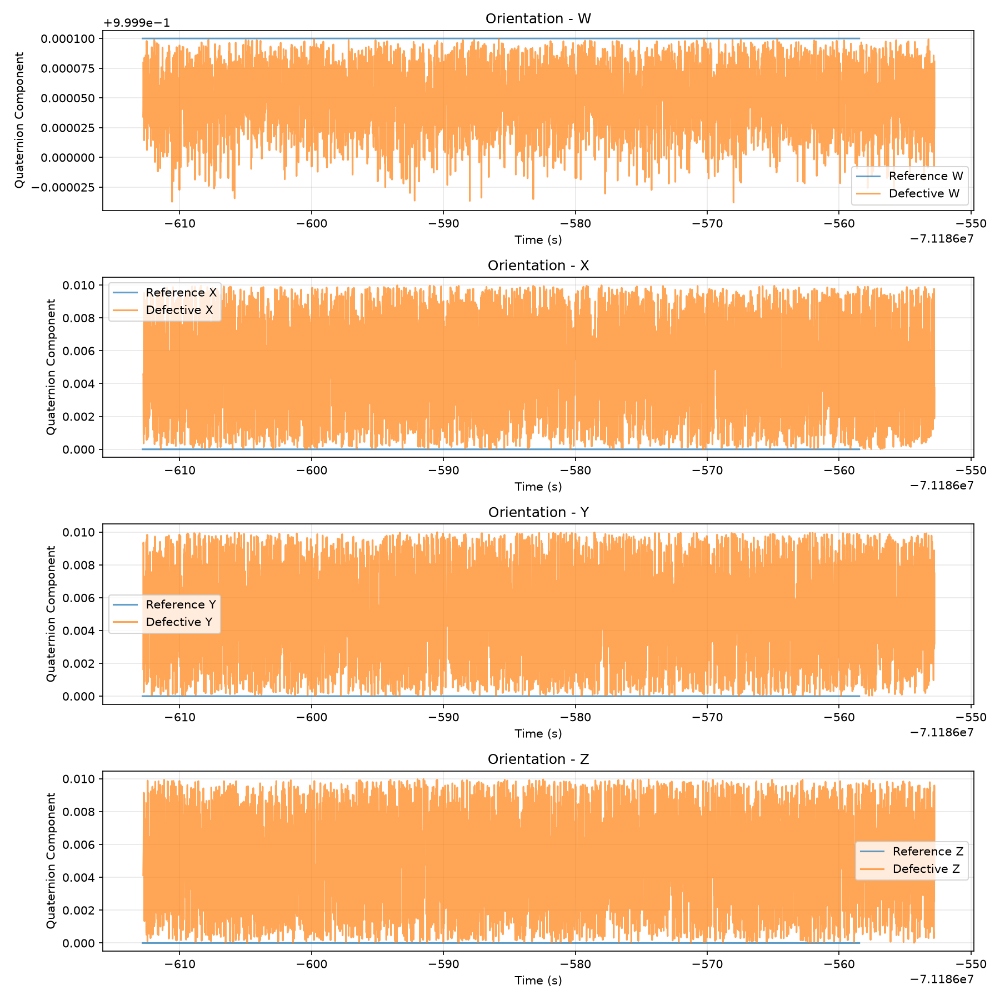
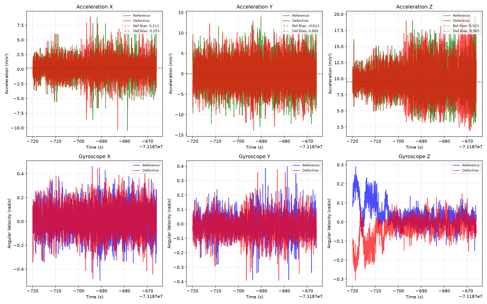

# Задание 3

[**Репозиторий решения с кодом**](https://github.com/Ayrat123T/inno_task3__IMU_Kalman_Madgwick__deffects_diagnostics)

Задание: с использованием ИИ-помощника выявить и устранить неисправности в программном конвейере обработки IMU-данных, работающем на rosbag2 или в симуляции.
Цель задания: научиться диагностировать типовые проблемы эксплуатации робототехнической системы по телеметрии, проверять гипотезы и подтверждать исправление повторным экспериментом без доступа к физическому роботу.
Инструкция выполнения:  

1. С помощью ИИ-помощника подготовьте или найдите rosbag2 с IMU-данными и создайте его дефектную копию. Смоделируйте не менее трёх проблем: смещение нуля, повышенный шум, неверный знак или ориентацию оси, пропуски сообщений, некорректный frame_id, ошибочную частоту, временную задержку либо неверные ковариации.
2. Завершите диагностический скрипт из выданного PyBook/Notebook: добавьте проверки частоты и временных меток, статистики сигналов, смещения в покое, выбросов, frame_id и ковариаций. Скрипт должен формировать понятный диагностический вывод.
3. Запустите фильтр Калмана и Madgwick на исправном и дефектном наборе. Определите, какие симптомы проявляются в графиках, ориентации и логах, и сформулируйте причины каждой проблемы.
4. Внесите исправления в данные, параметры или код, затем повторите воспроизведение rosbag2. Представьте сравнение «до/после» и докажите, что обнаруженные проблемы устранены либо их влияние уменьшено.
5. ИИ рекомендуется использовать для генерации гипотез, поиска причин ошибок и подготовки проверок. Каждый предложенный ИИ шаг необходимо подтвердить командой, графиком, логом или измеримой метрикой.
Критерии оценивания:

- Смоделированы и корректно описаны не менее трёх неисправностей.
- Диагностический скрипт завершён и обнаруживает заявленные проблемы по данным rosbag2.
- Показано влияние неисправностей на результаты фильтра Калмана и Madgwick.
- Исправление подтверждено повторным запуском и сравнением результатов «до/после».
1 балл – задание выполнено полностью, работоспособность решения подтверждена.
0,5 балла – задание выполнено с незначительными ошибками либо представлено неполное сравнение результатов.
0 баллов – задание выполнено со значительными ошибками, результат не подтверждён либо работа не выполнена.
Формат сдачи работы: файл в формате PDF. В отчёте должны быть ссылка на код и rosbag2, перечень неисправностей, диагностические доказательства и результаты повторной проверки.

## Решение

1. Напишем [ноду-скрипт](imu_defect_simulator.py), которая берет топик /ouster/imu и создаёт его дефектную копию

Проверяем:

```bash
(.venv) user@HP-EliteBook:~/ros2_ws$ /home/user/ros2_ws/.venv/bin/python /home/user/ros2_ws/src/inno/task3/imu_defect_simulator.py
[INFO] [1787128911.505887513] [imu_defect_simulator]: ============================================================
[INFO] [1787128911.506398780] [imu_defect_simulator]: IMU Defect Simulator Started
[INFO] [1787128911.506839175] [imu_defect_simulator]: Input:  /ouster/imu
[INFO] [1787128911.507313373] [imu_defect_simulator]: Output: /ouster/imu_defective
[INFO] [1787128911.507760981] [imu_defect_simulator]: Active defects:
[INFO] [1787128911.508242382] [imu_defect_simulator]:   - Zero bias: Accel [0.05, 0.03, -0.02], Gyro [0.01, -0.015, 0.005]
[INFO] [1787128911.508712082] [imu_defect_simulator]:   - Noise: Accel σ=0.02, Gyro σ=0.005
[INFO] [1787128911.509220013] [imu_defect_simulator]:   - Axis flips: ['AccelY', 'GyroZ']
[INFO] [1787128911.509724417] [imu_defect_simulator]:   - Message drops: 10%
[INFO] [1787128911.510234312] [imu_defect_simulator]:   - Timestamp delay: 50ms
[INFO] [1787128911.510819719] [imu_defect_simulator]:   - Frame ID corruption: 'defective_imu_frame'
[INFO] [1787128911.511372353] [imu_defect_simulator]:   - Covariance scaling: 10.0x
[INFO] [1787128911.511903578] [imu_defect_simulator]:   - Scale errors: Accel [1.0, 1.05, 0.95], Gyro [1.0, 0.97, 1.03]
[INFO] [1787128911.512436005] [imu_defect_simulator]: ============================================================
```

```bash
(.venv) user@HP-EliteBook:~/ros2_ws$ ros2 topic list
/events/read_split
/hunter/fix
/hunter/heading
/imu/rpy
/mti/imu
/ouster/imu
/ouster/imu_defective
/ouster/nearir_image
/ouster/range_image
/ouster/reflec_image
/ouster/signal_image
/parameter_events
/rosout
/tf
/tf_static
```

```bash
(.venv) user@HP-EliteBook:~/ros2_ws$ ros2 topic echo /ouster/imu_defective --once
header:
  stamp:
    sec: 1715943843
    nanosec: 867512937
  frame_id: defective_imu_frame
orientation:
  x: 0.002857177606763945
  y: 0.007349680169877021
  z: 0.00025855355153420596
  w: 0.9999688754594239
orientation_covariance:
- -1.0
- -10.0
- -10.0
- -10.0
- -10.0
- -10.0
- -10.0
- -10.0
- -10.0
angular_velocity:
  x: 0.027747399606325742
  y: -0.0818277221659259
  z: -0.004150840847025827
angular_velocity_covariance:
- 0.005999999999999999
- 0.0
- 0.0
- 0.0
- 0.005999999999999999
- 0.0
- 0.0
- 0.0
- 0.005999999999999999
linear_acceleration:
  x: 0.6049110270982941
  y: 0.6966349428529967
  z: 10.691566271299003
linear_acceleration_covariance:
- 0.1
- 0.0
- 0.0
- 0.0
- 0.1
- 0.0
- 0.0
- 0.0
- 0.1
---
```

2. напишем [ноду-скрпит](imu_data_logger.py), которая читает в течении 60 секунд o топики uster/imu и /ouster/imu_defective и строит графики сравнения основных параметров

 

 

 

 



отдельно сохраним [статистику](imu_analysis/statistics_20260819_120305.txt)

Добавим проверки частоты и временных меток, статистики сигналов, смещения в покое, выбросов, frame_id и ковариаций и реализуем в другом [скрипте](imu_analysis_2/imu_data_logger_2.py):



Сохраним отчёт в [json](imu_analysis_2/report_20260819_121940.json) и [txt](imu_analysis_2/report_20260819_121940.txt)

3. Запустим фильтр [Калмана](kalman.py) и [Madgwick](Madgwick.py) на исправном и дефектном наборе.

Для этого внесём изменния в их код, что бы он читал 2 топика исправный и дефектный и выдавал 2 топика

```bash
[INFO] [1787136761.602370520] [kalman_1d_node]: ============================================================
[INFO] [1787136761.602788976] [kalman_1d_node]: 1D Kalman Filter with Dual Input/Output
[INFO] [1787136761.603235556] [kalman_1d_node]: Signal: linear_acceleration.x
[INFO] [1787136761.603611061] [kalman_1d_node]: Q: 0.010, R: 0.640
[INFO] [1787136761.603973081] [kalman_1d_node]: Clean input: /ouster/imu
[INFO] [1787136761.604358616] [kalman_1d_node]: Defective input: /ouster/imu_defective
[INFO] [1787136761.604730535] [kalman_1d_node]: Clean output: /imu/kalman_1d_clean
[INFO] [1787136761.605151916] [kalman_1d_node]: Defective output: /imu/kalman_1d_defective
[INFO] [1787136761.605588026] [kalman_1d_node]: ============================================================


adgwick.py 
[INFO] [1787136781.211515443] [madgwick_node]: ============================================================
[INFO] [1787136781.211872654] [madgwick_node]: Madgwick Filter with Dual Input/Output
[INFO] [1787136781.212229074] [madgwick_node]: Beta: 0.100
[INFO] [1787136781.212583860] [madgwick_node]: Clean input: /ouster/imu
[INFO] [1787136781.212925292] [madgwick_node]: Defective input: /ouster/imu_defective
[INFO] [1787136781.213267605] [madgwick_node]: Clean output: /imu/madgwick_clean
[INFO] [1787136781.213598397] [madgwick_node]: Defective output: /imu/madgwick_defective
[INFO] [1787136781.213924770] [madgwick_node]: ============================================================

(.venv) user@HP-EliteBook:~/ros2_ws$ ros2 topic list
/events/read_split
/hunter/fix
/hunter/heading
/imu/kalman_1d_clean
/imu/kalman_1d_defective
/imu/madgwick_clean
/imu/madgwick_defective
/imu/rpy
/mti/imu
/ouster/imu
/ouster/imu_defective
/ouster/nearir_image
/ouster/range_image
/ouster/reflec_image
/ouster/signal_image
/parameter_events
/rosout
/tf
/tf_static
```

Проведём анализ топиков с помощью [скрипта](imu_compare_v3.py), который анализирует как чистые, так и дефектные топики для всех трех фильтров.


[Отчёт в формате json](imu_analysis_2/report_20260819_121940.json)

[Отчёт в формате txt](src/inno/inno_task3__IMU_Kalman_Madgwick__deffects_diagnostics/imu_analysis_2/report_20260819_121940.txt)

Полный результат экспортируем в [csv-файл](src/inno/inno_task3__IMU_Kalman_Madgwick__deffects_diagnostics/imu_dual_comparison_20260819_141821.csv)